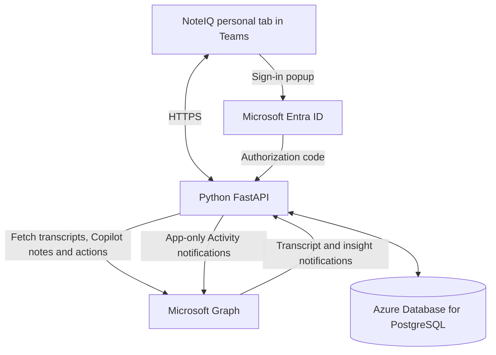

# NoteIQ tab prototype

This design replaces the personal bot in the original v2 specification. The current application uses no Azure Bot Service, bot registration, Bot Connector endpoint or Azure Functions host. See [transcripts and messages](transcripts-and-messages.md) for the current feature setup.

The browser uses TeamsJS 2.56.0 and the Adaptive Cards JavaScript renderer 3.0.6. Both are pinned and bundled under `web/vendor`, with licenses and integrity records; there are no runtime CDN requests. Python retains the Teams SDK card models for validation and uses MSAL for Entra authentication. The bot runtime is not part of this design.

## Sign-in and enrollment

1. The user clicks **Connect Microsoft 365**. The tab creates a random verifier and sends its SHA-256 challenge to the server.
2. MSAL creates an authorization-code flow, including state, nonce and PKCE. Its secrets stay in an expiring database record.
3. TeamsJS opens the sign-in popup; an ordinary browser uses a popup with an origin-checked message back to the page.
4. Entra redirects to `/auth/callback`. MSAL exchanges the code over HTTPS and validates the flow. The server checks the configured tenant and the user's object ID.
5. The popup returns a one-use, 60-second handoff code. Only the initiating tab can redeem it using its verifier.
6. The server enrolls the verified user and issues an opaque eight-hour NoteIQ session. Only its hash is stored. The tab keeps the session in session storage, with a memory-only fallback. Microsoft access and refresh tokens never reach the tab. Activity delivery uses the app token and the personal installation's `TeamsActivity.Send.User` resource-specific consent. No delegated chat permission or persistent user-token cache is used.

This avoids reliance on third-party cookies in Teams. Signing in authenticates the user; it does not grant the application's background Graph permissions. A Copilot license, admin consent and the application access policy remain prerequisites.

The eight-hour NoteIQ session window renews on real tab interaction (pointer,
keyboard, touch or wheel), at most once every five minutes through
`POST /api/session/renew`. Background polling does not renew it. Expired sessions,
logged-out sessions and disabled users cannot be renewed. No Microsoft sign-in is
needed merely because an actively used session crosses its original eight-hour
deadline. Closing the tab/losing session storage, prolonged inactivity, and Microsoft
consent or tenant-policy changes may still require sign-in; this is not persistent
Teams SSO. Microsoft delegated-token renewal remains separate.

## Background processing

Enrolled users replace the old `PILOT_USER_IDS` environment variable. Enrollment requests subscription setup immediately. The worker renews both transcript and insight subscriptions every 15 minutes with a one-hour expiry. Graph lifecycle callbacks request renewal; missed events are surfaced for manual recovery.

The webhook validates `clientState` for the entire batch and checks enrollment before writing event IDs to PostgreSQL. It acknowledges after the transaction commits. A worker fetches the meeting metadata, verifies that the subscribed user is the organizer, fetches either transcript content or the insight, and updates the meeting entry. A database activity outbox queues one insights-ready notification per meeting for the organizer. The same worker sends them as NoteIQ via the Graph Activity API, using the installed app's resource-specific permission; it does not post transcript or insight bodies. The tab checks for saved results every 15 seconds while visible.

Retryable processing failures are delayed and retried up to five times. Failed jobs stay in PostgreSQL for seven days for diagnosis; ordinary finished jobs are pruned after a day, so the polling sweep does not grow the table without bound. Processing resumes after a restart. Queue leases prevent multiple replicas from taking the same ready item. Several jobs run at once, bounded by `NOTEIQ_JOB_CONCURRENCY`, so one slow summary does not hold up the queue behind it; the store stays synchronous, which is what keeps each read-modify-write atomic against the others. `NOTEIQ_ROLE` can split the web tier and the worker into separate containers so the web tier scales out — see [scaling](scaling.md). New artifacts are grouped by meeting ID and deduplicated by artifact ID. Historical duplicate rows are retained. Activity event keys suppress repeated queueing, and stable chain IDs let retries update the same feed entry. There is no attendee correlation.

Raw transcripts are downloaded, stored and loaded through an authenticated endpoint when a user expands them. Copilot notes and action items are formatted without another LLM. Card content is rendered as text, without executing model-generated HTML or actions. API responses and OAuth pages have `Cache-Control: no-store`; the server does not log request URLs or meeting content.

## Storage and access

The local default database is `data/noteiq.sqlite3`, excluded from version control with owner-only file permissions. Container Apps uses Azure Database for PostgreSQL when `NOTEIQ_DATABASE_URL` is set. It contains enrolled identities, temporary sign-in records, session hashes, pending event IDs, saved meeting results, raw transcripts and an activity outbox. SQLite is retained only for local development and tests; it must not be placed on Azure Files.

Meeting APIs always use the authenticated session's user ID. Browser-supplied user IDs cannot select another person's cards. Disconnect disables processing, revokes all that user's sessions and deletes their saved cards, transcripts, queued notifications. Previously delivered Activity entries remain in Teams. Subscription deletion follows in the worker; incoming events and in-flight saves are ignored immediately after disconnect. Signing out only revokes the current session. Removing the Teams package alone does not signal this tab-only service to disconnect; use the in-app Disconnect button first.

PostgreSQL supports concurrent Container App replicas. For the prototype, storage is retained until disconnect or operator removal; the UI shows the latest 100 saved cards.

## Boundaries of this version

- Automatic updates appear inside NoteIQ. Teams Activity notifications come from NoteIQ and open the installed personal tab. No chat messages or bot runtime are used.
- Enrollment starts on successful sign-in. Existing meetings are recovered explicitly with `scripts.recover`.
- A successful subscription is not proof that all meeting-access policy and license checks will succeed. Those failures are surfaced when fetching insights.
- The browser is embedded in Teams; Microsoft sign-in, Graph access, tenant policy and custom-app upload still require a live tenant test.
- The code does not establish full UAE residency. Verify the HTTPS gateway's location and your Microsoft 365 service commitments separately.

Microsoft references: [tabs](https://learn.microsoft.com/en-us/microsoftteams/platform/tabs/what-are-tabs), [tab sign-in](https://learn.microsoft.com/en-us/microsoftteams/platform/tabs/how-to/authentication/auth-tab-aad), [MSAL authorization-code flow](https://learn.microsoft.com/en-us/entra/msal/python/getting-started/acquiring-tokens#acquire-token-by-authorization-code-flow), [insight subscriptions](https://learn.microsoft.com/en-us/microsoft-365/copilot/extensibility/api/ai-services/change-notifications/aiinsights-changenotifications), [insight API permissions](https://learn.microsoft.com/en-us/microsoft-365/copilot/extensibility/api/ai-services/meeting-insights/callaiinsight-get).
